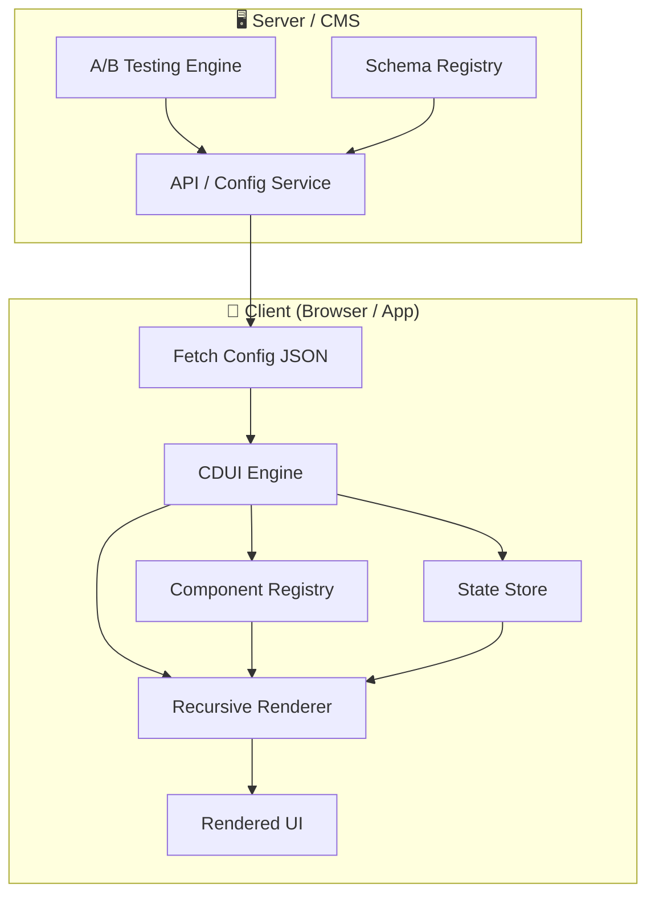

# Config-Driven UI (CDUI) — Complete Architecture Guide

> **Frontend System Design** ka ek essential pattern — jisse Swiggy, Zomato, Flipkart, Airbnb, Uber jaise companies apna UI server se control karti hain.

---

## 🤔 What is Config-Driven UI? (CDUI kya hai?)

Config-Driven UI (ya Server-Driven UI / SDUI) ek architecture pattern hai jismein:

> **UI ko hardcode nahi karte, balki ek JSON configuration se dynamically generate karte hain.**

```
Traditional UI:  Developer likhta hai → <Card title="..." />  (hardcoded)
Config-Driven:   Server bhejta hai →   { type: "card", props: { title: "..." } }  (dynamic)
```

### Hindi mein samjho:

Imagine karo ek **restaurant menu** — traditional approach mein, menu print karke lagaya jata hai. Agar koi dish change karni ho toh naya menu print karna padega. Lekin **digital menu board** mein, backend se data change karo aur display turant update ho jata hai. CDUI bhi isi tarah kaam karta hai!

---

## 🏗️ Architecture Diagram



---

## 🔧 Core Architecture Components

### 1. Component Registry (Component Registry kya hai?)

```javascript
// ek Map jismein string type → builder function mapped hai
const ComponentRegistry = {
  "banner": (node) => { /* DOM banao */ },
  "card":   (node) => { /* DOM banao */ },
  "input":  (node) => { /* DOM banao */ },
  // ... aur bhi components
};
```

**Hindi:** Socho ek factory hai — tum bolte ho "mujhe card chahiye" toh factory card bana deta hai. Tum bolte ho "mujhe banner chahiye" toh banner bana deta hai. `type` field se pata chalta hai kaunsa component banana hai.

### 2. Recursive Renderer (Recursive Renderer kaise kaam karta hai?)

```javascript
function renderNode(node) {
  // 1. showIf condition check karo
  if (node.showIf && !evaluateCondition(node.showIf)) {
    return null; // render mat karo
  }

  // 2. Registry se builder function lo
  const builder = ComponentRegistry[node.type];

  // 3. Element banao
  const element = builder(node, (children, parent) => {
    // 4. Recursively saare children render karo
    children.forEach(child => {
      const childEl = renderNode(child); // ← RECURSION!
      parent.appendChild(childEl);
    });
  });

  return element;
}
```

**Hindi:** Ye ek tree traversal hai — root node se shuru karo, builder function call karo, fir uske children ko bhi same process se render karo. Jaise ek **file explorer** — folder ke andar folder, uske andar files — sab recursively render hota hai.

### 3. State Store (Reactive State Management)

```javascript
const StateStore = {
  _state: {},          // { accountType: "business", fullName: "Rahul" }
  _listeners: [],      // onChange callbacks

  set(field, value) {
    this._state[field] = value;
    this._listeners.forEach(fn => fn());  // re-render trigger
  },

  get(field) {
    return this._state[field];
  }
};
```

**Hindi:** Jab user form mein kuch type kare ya dropdown select kare, state store mein save hota hai. Aur jab state change hoti hai, saare dependent components automatically re-render ho jaate hain.

### 4. Conditional Rendering (showIf)

```json
{
  "type": "section",
  "props": { "title": "Business Details" },
  "showIf": { "field": "accountType", "equals": "business" },
  "children": [...]
}
```

**Hindi:** Ye hai CDUI ka sabse powerful feature! Agar `accountType` ka value `"business"` hai tabhi ye section dikhega, warna nahi. Server decide karta hai ki kaun si condition pe kya dikhana hai — bina app update kiye!

### 5. Action Dispatcher

```javascript
// Button click pe action fire hota hai:
{
  "type": "button",
  "props": {
    "label": "Submit",
    "onClick": {
      "type": "submit",       // action type
      "message": "Form submitted!"
    }
  }
}
```

**Hindi:** User jab button click kare toh kya hoga — ye bhi JSON mein define hai! Toast dikhana hai, form submit karna hai, navigation karna hai — sab config-driven hai.

---

## 🏢 Real-World Usage

| Company | How they use CDUI |
|---------|------------------|
| **Swiggy/Zomato** | Home feed, restaurant cards, offers — sab server-driven |
| **Flipkart/Amazon** | Product pages, category layouts, sale banners |
| **Airbnb** | Search results, listing pages, dynamic filters |
| **PhonePe/Paytm** | KYC forms, payment flows, promotional sections |
| **Uber** | Ride options, pricing cards, surge indicators |

---

## 🎯 Benefits (Fayde)

1. **🚀 No App Store Release Needed** — UI change karna hai? Server pe JSON update karo, app restart bhi nahi chahiye.
2. **🧪 A/B Testing** — Different users ko different UI dikhao without code changes.
3. **🔄 OTA Updates** — Over-the-air UI updates, especially mobile apps mein.
4. **📋 Non-Technical Control** — Product managers bhi CMS se UI change kar sakte hain.
5. **🌍 Personalization** — User ke location, preferences ke basis pe different UI.

---

## ⚠️ Challenges & Trade-offs

1. **🛡️ XSS Security** — JSON mein koi malicious script inject kar sakta hai. Always sanitize!
2. **📊 Schema Versioning** — Old app ko naya schema milega toh kya hoga? Backward compatibility rakhni padegi.
3. **🐌 Performance** — Bahut deeply nested schemas slow rendering kar sakti hain.
4. **🔍 Debugging** — Bugs trace karna mushkil — UI code mein nahi, JSON config mein hoga.
5. **📏 Limited Flexibility** — Har possible UI pattern ko config mein express karna impossible hai.

---

## 🎤 Interview Topics & Questions

### Common Interview Questions:

1. **"Config-Driven UI mein component registry kaise implement karoge?"**
   → Map/Object mein type → builder function register karo. Factory pattern use karo.

2. **"Conditional rendering kaise handle karoge?"**
   → `showIf` property mein condition define karo, render time pe evaluate karo.

3. **"Schema versioning kaise karoge?"**
   → Version number attach karo, client pe migration logic rakho, fallback components for unknown types.

4. **"Performance optimize kaise karoge?"**
   → Virtual scrolling for long lists, lazy rendering for off-screen components, schema caching.

5. **"Security concerns kya hain?"**
   → XSS prevention (escape HTML), schema validation, no inline script execution from JSON.

6. **"Unknown component type aaye toh kya karoge?"**
   → Error boundary / fallback component render karo — graceful degradation.

---

## 📁 Project Structure

```
Config-Driven-UI/
├── index.html        ← Main playground page (split-screen editor + preview)
├── styles.css        ← Design system (glassmorphism, modern typography)
├── cdui-engine.js    ← Core engine (Registry, Renderer, State, Actions)
├── presets.js        ← 4 industry presets (Food, KYC, E-commerce, Dashboard)
└── README.md         ← This architecture guide
```

---

## 🚀 How to Run

1. Open `index.html` in any modern browser — **no build step needed!**
2. Click preset tabs to load different industry examples.
3. Edit JSON on the left — see UI update instantly on the right.
4. Try selecting "Business" in the KYC Form to see conditional rendering in action.
5. Click buttons to see Action Dispatcher + Event Log working.

---

> **Pro Tip:** Ye project directly Frontend System Design interviews mein showcase kar sakte ho. Interviewer ko live demo dikhao — JSON edit karo, UI change dikhao, conditional rendering explain karo. 💪
